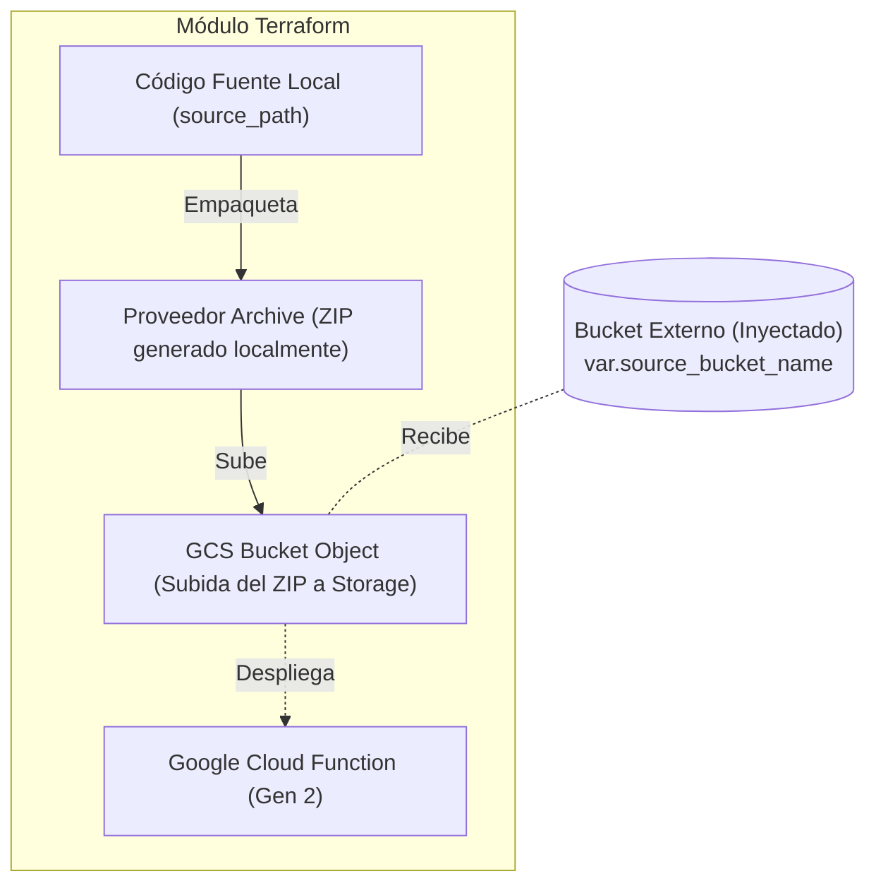

# Arquitectura del Módulo Cloud Function

Este documento detalla la arquitectura técnica y las decisiones de diseño para la implementación automatizada de Cloud Functions (Gen 2).

## Visión General
El módulo `cloudfunction` implementa un canal optimizado para la creación de funciones serverless en Google Cloud Platform. Su propuesta de valor principal es encargarse automáticamente del empaquetado del código fuente y su subida a un origen de Cloud Storage antes de realizar el despliegue final, a la vez que hace cumplir la robusta política de nomenclatura de recursos estipulada en el CoE de Taligent.

## Diagrama de Bloques (Mermaid)

## Decisiones Técnicas (ADR)
1.  **Separación de Responsabilidades en Storage**: A diferencia de crear un bucket por cada función, el módulo confía en la recepción de un `source_bucket_name` por variable. Esto obedece a las prácticas recomendadas de agrupar artefactos de código de distintas funciones en un único bucket de despliegues por entorno.
2.  **Packaging Built-in**: Se integró el proovedor nativo `archive` en la inicialización (vía bloque `data`) en lugar de delegar la compresión de `.zip` a un pipeline CI/CD de Bash u otras herramientas. Terraform detecta cambios en las propiedades de los archivos y recompila el ZIP en tiempo de ejecución.
En futuros cambios, sí se implementará un CI/CD para el empaquetado del código fuente.
3.  **Nomenclatura (Reglas Taligent)**: Se implementó un control detallado usando variables base (`client`, `project`, `environment`) y capas (domain, product, topic, layer). La estructura en `locals.tf` se encarga de prefijar los recursos (ej. `dev-taligent-rrhh-nomina-daily-bronze-function`) sin ensuciar los inputs de configuración.
4.  **Despliegue Dinámico y Estructura de Carpetas**: El consumo de este módulo en los entornos (ej. `dev/main.tf`) se realiza de manera dinámica sobre la estructura de directorios utilizando `for_each` y `fileset`. Para que GCP procese el código nativamente sin fallos, es mandatorio que el archivo Python se denomine `main.py` y se ubique en la ruta estructurada: `src/functions/{domain}/{product}/{topic}/{layer}/{function_name}/main.py`. Terraform extrae con Regex estas propiedades automáticamente.
## Componentes Terraform
- `main.tf`: Integración general. Instanciación del `archive_file`, el objeto en storage (`google_storage_bucket_object`) y el servicio serverless principal (`google_cloudfunctions2_function`).
- `variables.tf`: Entradas parametrizadas, que capturan los fragmentos estándar de nomenclatura, así como los punteros estáticos de ambiente y cliente.
- `locals.tf`: Concentra la lógica de prefijos obligatorios de convención para garantizar uniformidad.
- `outputs.tf`: Expone constructos finales como la URI y el nombre consolidado que Terraform generó, propicios para llamadas subsecuentes (triggers de Eventarc, etc.).
