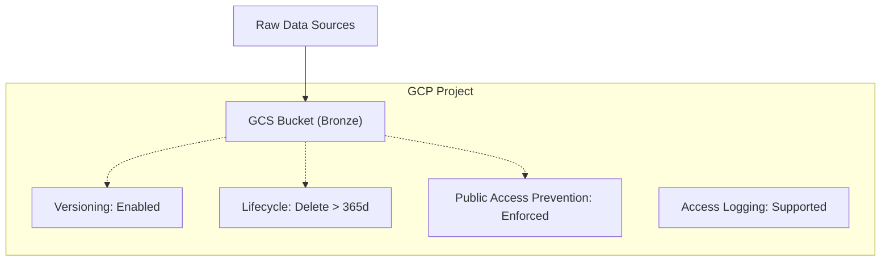

# Arquitectura del Módulo GCS Bronze

Este documento detalla la arquitectura técnica y las decisiones de diseño para el bucket de la capa `bronze`.

## Visión General
El módulo `gcs-bronze` implementa un bucket de Google Cloud Storage optimizado para la ingesta de datos crudos (Raw Data). Sigue el patrón Medallion y las reglas de seguridad del CoE de Taligent.

## Diagrama de Bloques (Mermaid)

## Decisiones Técnicas (ADR)
1.  **Nomenclatura**: Se utiliza el prefijo `${env}-taligent-coe-` para garantizar unicidad y cumplimiento normativo.
2.  **Seguridad**: El bloqueo de acceso público es mandatorio (`enforced`) para prevenir leaks de datos sensibles en la ingesta.
3.  **Auditoría**: Se incluyó soporte para `logging` externo para cumplir con auditorías de acceso de datos (requisito CoE).

## Componentes Terraform
- `main.tf`: Definición del recurso `google_storage_bucket`.
- `variables.tf`: Entradas parametrizadas para proyecto, región y ambiente.
- `locals.tf`: Lógica de construcción de etiquetas y nombres.
